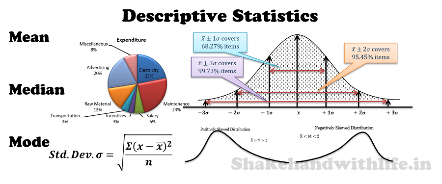

**Note:**

-An R Notebook is an R Markdown document with chunks that can be executed independently and interactively, with output visible immediately beneath the input.

-Notebook output are available as HTML, PDF, Word, or Latex. 

-This Notebook as HTML is preferably open with Google Chrome.

-R-Code can be extracted as Rmd file under the button "Code" in the notebook.

-This Notebook using iterative development. It means the process starts with a simple implementation of a small set of idea requirements and iteratively enhances the evolving versions until the complete version is implemented and perfect.

 

#Grundlagen

##Grundgesamtheit, Stichprobe, Merkmale

##Merkmals- und Skalentypen

##Objektivität, Reliabilität, Validität

##Mathematische Begriffen

#Eine Variable:

#1. Häufigkeitstabellen
#2. Lageparameter
##Arithmetischer Mittelwert
##Median
##Modus
##Quantile
#3. Streuungsparameter
##Spannweite und Quartilsabstand
##Varianz und Standardabweichung
##Variationskoeffizient
#4. Konzentrationsparameter
##Lorenzkurve
##Gini-Koeffizient
#5. Darstellung von Daten
##Balkendiagramme
##Verteilungsfunktion
##Boxplots
##Histogramme

#Zwei und mehr Variablen:
#Zwei diskrete Variablen
##Kreuztabellen / Kontingenztafeln
###Bedingte Häufigkeiten
##Zusammenhangsmaße
###χ2-Koeffizient und Kontingenzkoeffizient K
###ϕ-Koeffizient
#Zwei stetige Variablen
##Streudiagramme
##Zusammenhangsmaße
###Korrelation und Kausalität
###Korrelation r nach Pearson
 *Empirische Kovarianz
###Spearman-Korrelation / Rangkorrelation

 

#Change log update

*30.10.2013
*30.01.2019

 

#Preferences

* Statistik 1, Prof. Dr Beate Bergter,WS 2013, Hochschule für Technik und Wirtschaft Berlin
* Toutenburg, H., Heumann, C. (2008). Deskriptive Statistik. Eine Einführung mit R und SPSS, Springer Verlag, Berlin. e-ISBN 978-3-540-77788-5 
* https://www.statistik-nachhilfe.de/
* https://www.crashkurs-statistik.de/

 

#License

[MIT](https://opensource.org/licenses/MIT)